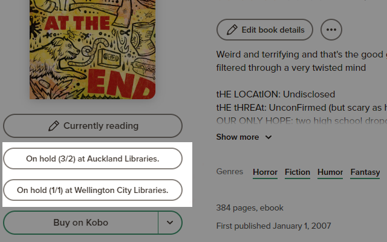

#  FindReads

FindReads is a Chrome extension for locating GoodReads books in OverDrive.

It is similar to the [Available
Reads](https://chrome.google.com/webstore/detail/available-reads/gclnfffacbjpclfenjgefpfnafmjghhk?hl=en)
extension which no longer works with the GoodReads “new book page”.

## Configuration

Before you can use the extension you will need to configure it to work with your
local library. To configure the extension, go to the extension options page.

You will need to enter a list of OverDrive sites to search, e.g.
`my-local-library.overdrive.com`. This should be space or newline-separated.

## Credits

The icon was created by [HideMaru](https://www.flaticon.com/authors/hidemaru).
